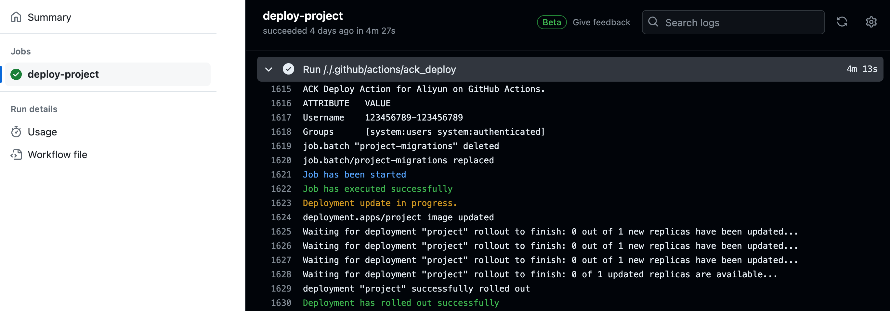

# Aliyun ACK Deploy Action
_To automatically deploy containers to Alibaba Cloud via ACK product._



### How it works

* Optionally runs a prepare job (e.g. migrations) before the main deployment
  * Leverages `kustomize` to update the image in the job config yaml
  * Leverages the `kubectl` command to run a job and monitor output
* Afterward, it will update the deployment with the new image
  * Leverages `kubectl` to apply the new configuration (image) and monitor

---

## Usage
_includes examples from other packages to give context_

```yaml
-   uses: aliyun/ack-set-context@v1
    with:
      access-key-id: access-key-id
      access-key-secret: access-key-secret
      cluster-id: cluster-id

-   uses: sourcetoad/ack-deploy-action@v1
    with:
      ack_deployment_name: project-name
      prepare_task_config_filepath: ./path/to/prepare-task.yml
      prepare_job_name: project-migrations-job
      prepare_job_container_image_changes: initial=123456789100.cr.me-central-1.aliyuncs.com/nginx:version
      deployment_container_image_changes: >
        php=123456789100.cr.me-central-1.aliyuncs.com/php:version
        nginx=123456789100.cr.me-central-1.aliyuncs.com/nginx:version
      kubeconfig_location: /github/home/ack_kubeconfig
```

## Customizing

### inputs

Following inputs can be used as `step.with` keys

| Name                                  | Required | Type    | Description                                                                   |
|---------------------------------------|----------|---------|-------------------------------------------------------------------------------|
| `ack_deployment_name`                 | true     | string  | The name of the deployment to update                                          |
| `prepare_task_config_filepath`        | false    | string  | The path to the task configuration file                                       |
| `prepare_job_name`                    | false    | string  | The name of the job to run before the main deployment                         |
| `prepare_job_container_image_changes` | false    | string  | The container image changes for the prepare job                               |
| `deployment_container_image_changes`  | true     | string  | The container image changes for the main deployment                           |
| `kubeconfig_location`                 | true     | string  | The location of the kubeconfig file                                           |
| `max_polling_iterations`              | false    | number  | The maximum number of iterations (5s) to poll job before considered a failure |
| `dry_run`                             | false    | boolean | Whether to run the action without making changes                              |
| `rollback_deployment_on_failure`      | false    | boolean | Whether to rollback the deployment on failure                                 |
| `rollout_watch_timeout`               | false    | string  | The timeout to be sent to the kubectrl rollout command such as 10m or 60s     |

## Prepare Task
Some projects may require a task to complete prior to the rollout of the main system. This is commonly for migrations in Laravel projects.
These set of configurations allow when set require the task to execute and continue to completion prior to the main services updating.

## Container Image Changes

When wishing to change multiple images in one task definition, leverage the formatting of Folded Style parameters.

Given this example:
```yaml
- uses: sourcetoad/ack-deploy-action@v1
  with:
    container_image_changes: >
      nginx=123456789100.cr.me-central-1.aliyuncs.com/nginx:version
      php=123456789100.cr.me-central-1.aliyuncs.com/php:version
```
* This will crawl the image definitions of the task definition
* Finding the first container that has name `nginx`
  * Adapting the `image` property to `123456789100.dkr.ecr.us-east-1.amazonaws.com/nginx:version`
* Finding the next container that has name `php`
  * Adapting the `image` property to `123456789100.dkr.ecr.us-east-1.amazonaws.com/php:version`
